- [概览](#概览)
  - [模块1：inferencer](#模块1inferencer)
    - [preprocess](#preprocess)
    - [inference](#inference)
    - [postprocess](#postprocess)
  - [模块2：angle\_detector](#模块2angle_detector)
    - [process](#process)
    - [save\_res](#save_res)
    - [vis\_res](#vis_res)

# 概览

## 模块1：inferencer

### preprocess

### inference
略

### postprocess
xxx

## 模块2：angle_detector

### process
xxx

### save_res
xxx

### vis_res
xxx